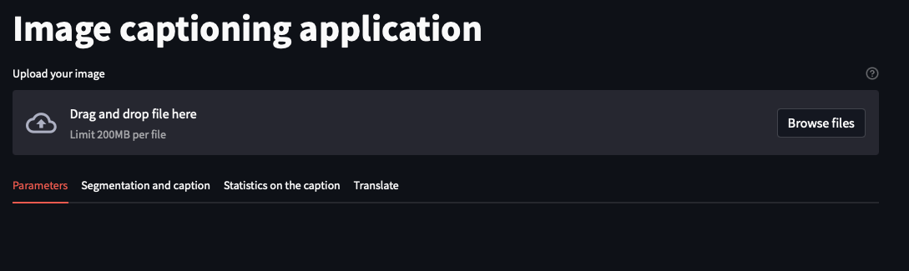
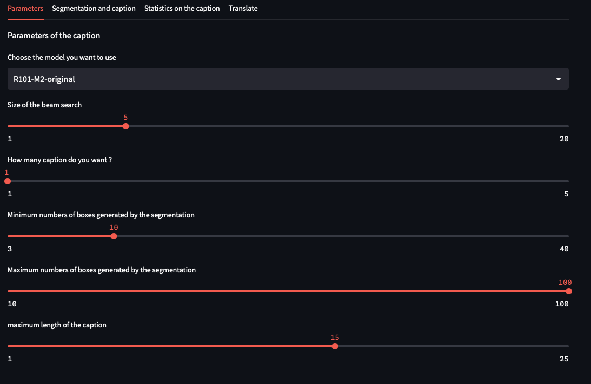
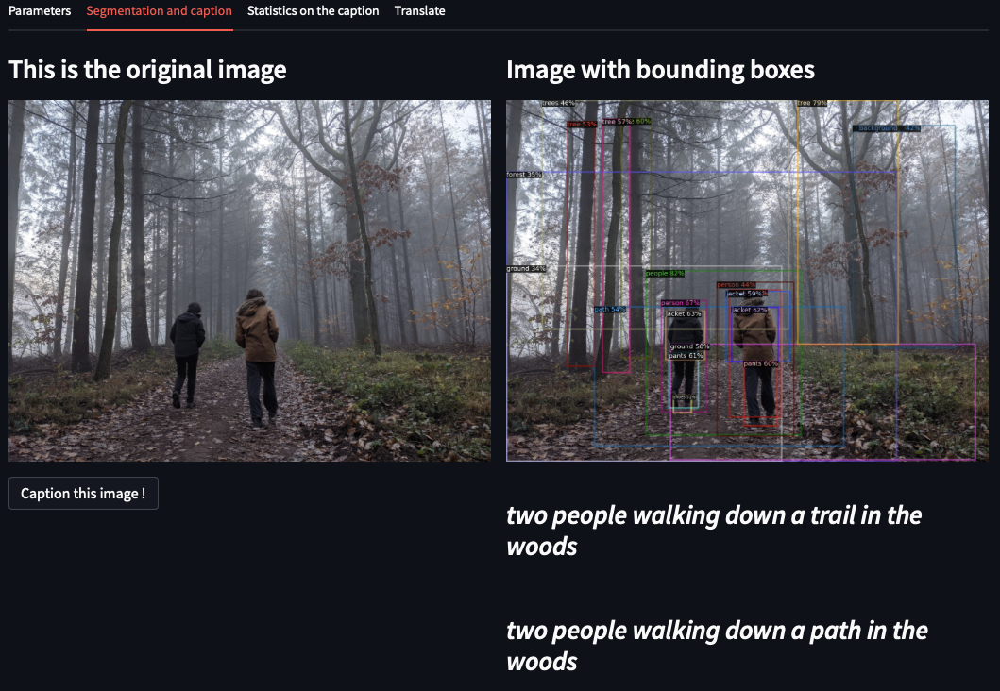
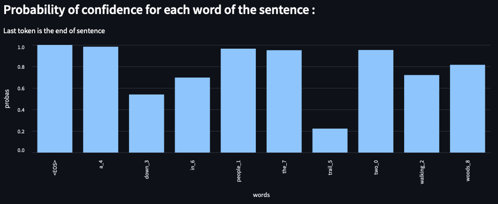
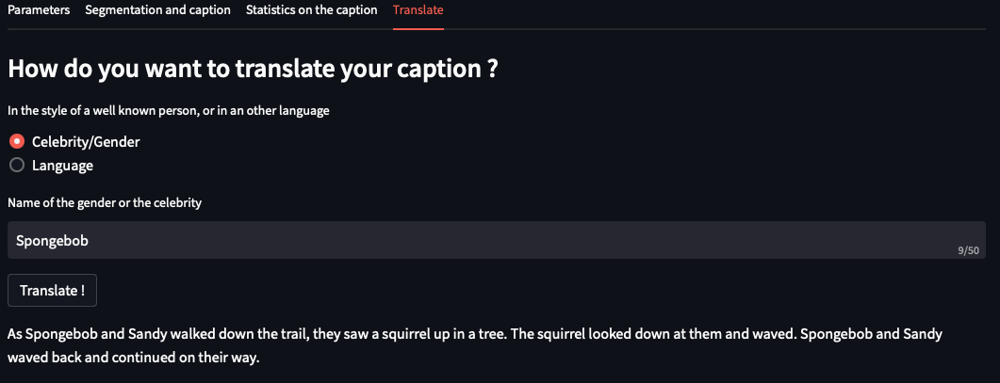

# Interface

Avant tout, l'interface est disponible en ligne à l'adresse suivante : https://captioning.zefresk.com.

## Objectifs

L'inteface a pour objectif de mettre à disposition facilement les modèles que nous avons entrainés lors de ce projet. Elle offre la possibilité de paramètrer plusieurs options que nous détaillerons plus tard pour voir comment les différents modèles réagissent.

De plus, notre interface offre également la possibilité de traduire la description de l'image en un autre style ou dans une autre langue.

Enfin, l'interface a été délpoyée sur le web afin d'éviter les problèmes d'installation laborieuse aux utilisateurs, de fait, elle est accessible en un seul clic.

## Présentation de l'interface

### Accueil et onglets

La Page d'acceuil propose à l'utilisateur de télécharger la photo de son choix sur l'application. Par la suite l'utilisateur aura le choix entre 4 onglets.

- Le premier onglet sert à paramétrer les options du modèles. 
- Le second onglet, quant à lui, sert à appliquer et visualiser la segmentation ainsi que la description de l'image.
- Le troisième onglet présente une graphique représentant la probabilité d'appartenance d'un mot à la description.
- Enfin, le dernier onglet permet de traduire la description générée dans un autre style ou une autre langue.

Voici un aperçu de l'accueil : 

### Paramètres

L'onglet paramètres permet d'ajuster les paramètres suivants : 

- Choix du modèle : Plusieurs modèles sont disponibles, parmi eux on retrouve : 
    - le modèle original de l'article qui utilise des plongements ResNet 101 (les autres modèles utilisent des plongements ResNet 152)
    - Un modèle avec 256 cases "mémoires", entrainé en utilisant de l'apprentissage par renforcement sur la métrique SPIDER.
    - Un modèle avec 256 cases "mémoires", également entrainé en utilisant de l'apprentissage par renforcement mais sur la métrique CIDEr cette fois.
    - un modèle sans cases mémoires et entrainé sur la métrique CIDEr. (celui ci à tendance à ne pas finir ses phrases à cause d'un bug lié à la mauvaise utilisation de la métrique CIDEr par l'article original du *Meshed Memory Transformer*).

- Le nombre de noeud mémorisé dans la recherche en faisceau.
- Le nombre de description que le modèle doit générer.
- Une fourchette pour le nombre de regions d'interêt que le modèle doit considérer lors de la segmentation.
- La taille maximale de la phrase de description de l'image.

Les paramètres se présentent comme ci-dessous : 

### Segmentation et description

L'utilisateur peut lancer une inférence à partir de cet onglet permettant d'afficher la segmentation ainsi que la/les descriptions.

Voici un exemple d'une inférence pour une image lambda prise par l'un d'entre nous :

### Statistiques

L'onglet statistiques permet d'afficher la probabilité de sélection de chaque mots de la description. Chaque mot est écrit sous la forme "*mot*_*indice dans la phrase*".

### Traduction

Enfin, le dernier onglet permet de traduire la dernière description générée dans un autre style ou dans une langue différente. Voici un exemple illustrant cette utilisation.

